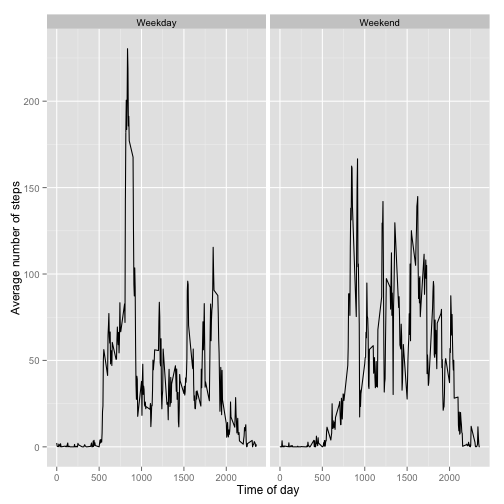

# Reproducible Research: Peer Assessment 1


## Loading and preprocessing the data


```r
activity=read.csv("activity.csv")
```

## Distribution of total number of steps taken per day

 

## What is mean total number of steps taken per day?


Mean number of steps: 37.3826

Median number of steps: 0

## What is the average daily activity pattern?

 
## Imputing missing values


The number of missing values in the step variable is 2304.
The number of missing values in the interval variable is 0.
The number of missing values in the date variable is 0.

 

Mean number of steps with missing values imputed: 37.3826

Median number of steps with missing values imputed : 0

## Are there differences in activity patterns between weekdays and weekends?

 

